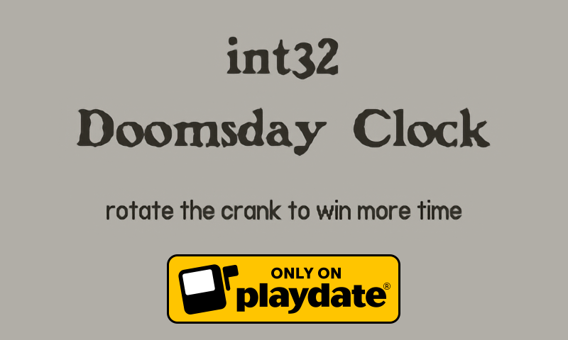
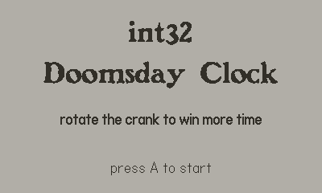
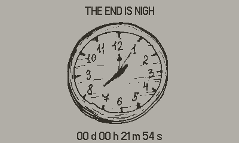
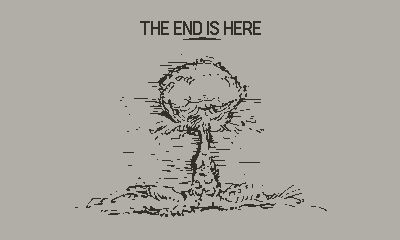

# int32-doomsday-clock

A short game for 1-bit-jam 6 for Playdate

[**Download from itch.io**](https://mitya.itch.io/int32-doomsday-clock)

Uses image that generated from font http://moorstation.org/typoasis/designers/steffmann/samples/b/benjamin.htm

## Screenshots

## Links

https://itch.io/jam/1-bit-jam-6

## Acknowledgments

- Uses image that generated from font [Benjamin Franklin](http://moorstation.org/typoasis/designers/steffmann/samples/b/benjamin.htm)
- [Wall Clock Ticking.wav by straget](https://freesound.org/people/straget/sounds/405423/)
- Images by [Nastya Yakovleva](https://vk.com/pinkpainterka)
- [Earth tectonic movements by EKVelika](https://freesound.org/people/EKVelika/sounds/668067/)